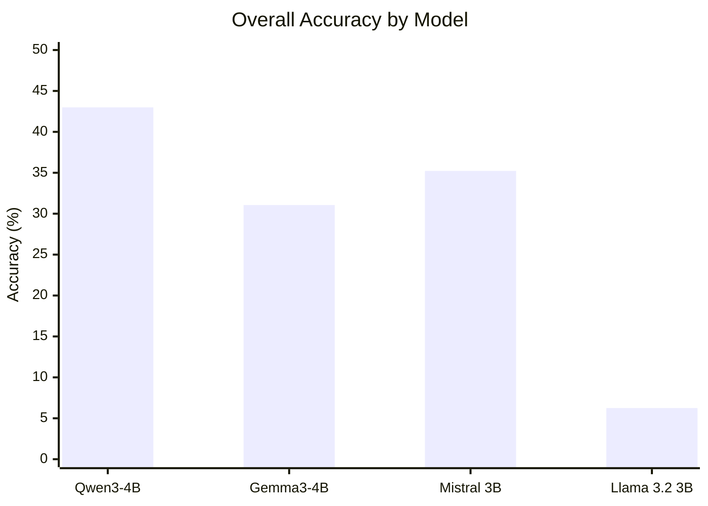

  ,,,,  nhg`6789# GPT-4.1 LLM-as-Judge Final-Answer Evaluation

This report evaluates the generated final answers from four models using `openai/gpt-4.1` through OpenRouter as an LLM-as-judge. The judge compared the expected final answer against the model-generated final-answer candidate and assigned `1` for correct and `0` for incorrect.

## Method

- Judge model: `openai/gpt-4.1` via OpenRouter.
- Evaluation target: final-answer equivalence only.
- Input to judge: expected final answer and extracted generated final-answer candidate; raw generated-answer tail was included only when extraction was missing or malformed.
- Grading: `1` if complete and mathematically equivalent; `0` if wrong, incomplete, missing a required part/condition/unit, wrong sign, contradictory, or no clear final answer.
- Formatting tolerance: LaTeX spacing, boxes, Bengali/English digits, equivalent exact/decimal forms, and `C`/`c` integration constants were treated as harmless.
- This report is intentionally based on the LLM-as-judge pass, not on the earlier manually corrected labels.
- Estimated OpenRouter judge cost recorded from API usage: `$1.7563`.

## Overall Accuracy

| Model | Correct | Incorrect | Total | Accuracy | Judge Cost |
|---|---:|---:|---:|---:|---:|
| Qwen3-4B | 227 | 301 | 528 | 42.99% | $0.3797 |
| Gemma3-4B | 164 | 364 | 528 | 31.06% | $0.5390 |
| Mistral 3B | 186 | 342 | 528 | 35.23% | $0.4535 |
| Llama 3.2 3B | 33 | 495 | 528 | 6.25% | $0.3841 |

### Overall Accuracy Graph

| Model | Accuracy | Bar |
|---|---:|---|
| Qwen3-4B | 42.99% | `██████████░░░░░░░░░░░░░░` |
| Gemma3-4B | 31.06% | `███████░░░░░░░░░░░░░░░░░` |
| Mistral 3B | 35.23% | `████████░░░░░░░░░░░░░░░░` |
| Llama 3.2 3B | 6.25% | `██░░░░░░░░░░░░░░░░░░░░░░` |

### Chapter-by-Chapter Accuracy

| Chapter | Total | Qwen3-4B | Gemma3-4B | Mistral 3B | Llama 3.2 3B |
|---|---:|---:|---:|---:|---:|
| সমাকলন | 78 | 45/78 (57.69%) | 27/78 (34.62%) | 31/78 (39.74%) | 0/78 (0.00%) |
| অন্তরীকরণ | 74 | 47/74 (63.51%) | 40/74 (54.05%) | 40/74 (54.05%) | 9/74 (12.16%) |
| ত্রিকোণমিতি | 41 | 16/41 (39.02%) | 13/41 (31.71%) | 15/41 (36.59%) | 3/41 (7.32%) |
| গতিবিদ্যা | 38 | 5/38 (13.16%) | 1/38 (2.63%) | 10/38 (26.32%) | 2/38 (5.26%) |
| কণিক | 37 | 10/37 (27.03%) | 2/37 (5.41%) | 3/37 (8.11%) | 2/37 (5.41%) |
| সরলরেখা | 35 | 14/35 (40.00%) | 11/35 (31.43%) | 12/35 (34.29%) | 2/35 (5.71%) |
| স্থিতিবিদ্যা | 34 | 3/34 (8.82%) | 1/34 (2.94%) | 5/34 (14.71%) | 0/34 (0.00%) |
| সম্ভাবনা | 33 | 24/33 (72.73%) | 18/33 (54.55%) | 16/33 (48.48%) | 5/33 (15.15%) |
| বৃত্ত | 25 | 6/25 (24.00%) | 4/25 (16.00%) | 8/25 (32.00%) | 0/25 (0.00%) |
| বহুপদী ও সমীকরণ | 22 | 9/22 (40.91%) | 7/22 (31.82%) | 9/22 (40.91%) | 0/22 (0.00%) |
| দ্বিপদী বিস্তৃতি | 20 | 7/20 (35.00%) | 3/20 (15.00%) | 4/20 (20.00%) | 1/20 (5.00%) |
| বিন্যাস ও সমাবেশ | 20 | 6/20 (30.00%) | 4/20 (20.00%) | 4/20 (20.00%) | 1/20 (5.00%) |
| জটিল সংখ্যা | 19 | 7/19 (36.84%) | 7/19 (36.84%) | 8/19 (42.11%) | 3/19 (15.79%) |
| ভেক্টর | 18 | 9/18 (50.00%) | 8/18 (44.44%) | 7/18 (38.89%) | 1/18 (5.56%) |
| ম্যাট্রিক্স ও নির্ণায়ক | 12 | 7/12 (58.33%) | 7/12 (58.33%) | 5/12 (41.67%) | 1/12 (8.33%) |
| ফাংশন | 10 | 5/10 (50.00%) | 6/10 (60.00%) | 5/10 (50.00%) | 2/10 (20.00%) |
| বাস্তব সংখ্যা ও অসমতা | 9 | 5/9 (55.56%) | 3/9 (33.33%) | 4/9 (44.44%) | 1/9 (11.11%) |
| রৈখিক প্রোগ্রামিং | 3 | 2/3 (66.67%) | 2/3 (66.67%) | 0/3 (0.00%) | 0/3 (0.00%) |

## Output Files

- `results/research_gpt41/labels/research_gpt41_qwen3_4b_answer_labels.jsonl`
- `results/research_gpt41/summaries/research_gpt41_qwen3_4b_overall_accuracy.json`
- `results/research_gpt41/summaries/research_gpt41_qwen3_4b_evaluation_per_id_with_chapter.jsonl`
- `results/research_gpt41/summaries/research_gpt41_qwen3_4b_chapter_accuracy.json`
- `results/research_gpt41/labels/research_gpt41_gemma3_4b_answer_labels.jsonl`
- `results/research_gpt41/summaries/research_gpt41_gemma3_4b_overall_accuracy.json`
- `results/research_gpt41/summaries/research_gpt41_gemma3_4b_evaluation_per_id_with_chapter.jsonl`
- `results/research_gpt41/summaries/research_gpt41_gemma3_4b_chapter_accuracy.json`
- `results/research_gpt41/labels/research_gpt41_mistral3_3b_answer_labels.jsonl`
- `results/research_gpt41/summaries/research_gpt41_mistral3_3b_overall_accuracy.json`
- `results/research_gpt41/summaries/research_gpt41_mistral3_3b_evaluation_per_id_with_chapter.jsonl`
- `results/research_gpt41/summaries/research_gpt41_mistral3_3b_chapter_accuracy.json`
- `results/research_gpt41/labels/research_gpt41_llama3_2_3b_instruct_answer_labels.jsonl`
- `results/research_gpt41/summaries/research_gpt41_llama3_2_3b_instruct_overall_accuracy.json`
- `results/research_gpt41/summaries/research_gpt41_llama3_2_3b_instruct_evaluation_per_id_with_chapter.jsonl`
- `results/research_gpt41/summaries/research_gpt41_llama3_2_3b_instruct_chapter_accuracy.json`
